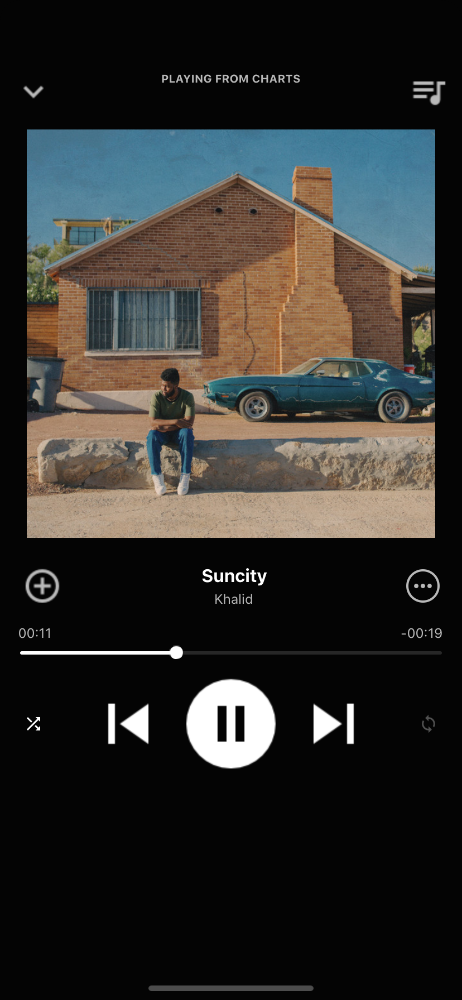

# Shortify

My React Native app that simulates parts of the Spotify mobile app. 

### Player UI.

This player UI is based on https://github.com/aakashns/ReactMusic by Aakash N S.
The playlist is retrieved from my own playlist via Spotify public API. To use the Spotify public API via an App, we need a client ID and a secret key,
which can be easily generated by registering your app via the Spotify dashbord. https://developer.spotify.com/documentation/general/guides/app-settings/

The `add`, `more` and `music queue` buttons are purely icons. They will not trigger anything if you click them. I will work on them in the future.
You can slide down the player UI or click the `down` button to go to the search UI. 

### Search UI.
Songs that aren't available to play as a preview will be makred with a small red icon on its right end side.

### Demo
Click the songs returned from the search results will play the song in the background for 30s as a preview.

### Run on your Machine

You need `react-native` and xcode to build the app on your local machine.
Once you have `react-native` and xcode installed, you can run `npm install` and then `react-native run-ios` or `react-native android` (I built this app for ios, so some parts may not work properly on android) 
<b>Note:</b> You need your `client id` and `secrent` in `App.js`. 
